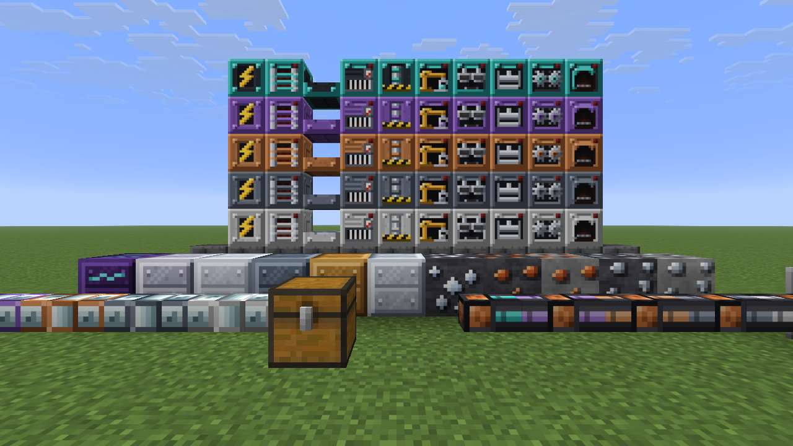
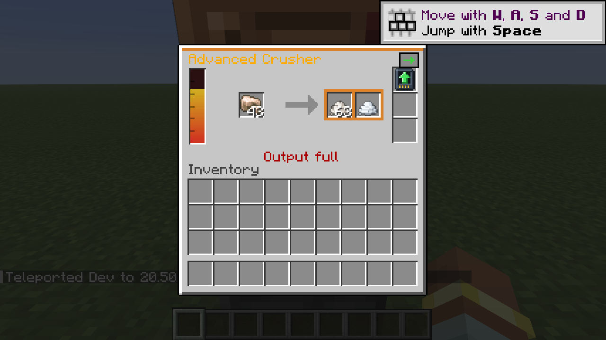

# Factory Ascent

A progression-focused tech mod for **Minecraft 26.2 (NeoForge 26.2.0.88)**, made for
co-op survival and small servers.

The core idea: **your first machines never become dead weight.** Every machine,
generator, cable and pipe comes in five tiers (Basic → Reinforced → Advanced →
Elite → Ultimate) and can be **upgraded in place** without losing its contents.
A better miner never leaves you choosing between a bottleneck and ten more
furnaces.

It follows the conventions of the classic tech mods (Mekanism's tier installers
and ore multipliers, Thermal's frames and tier-unlocked upgrade slots, GregTech's
tier-gated recipes, Immersive Engineering's hammer and press moulds). See
[docs/DESIGN.md](docs/DESIGN.md) for the full design and the numbers.

## What's in it

| Machines (×5 tiers) | Power (×5 tiers) | Logistics (×5 tiers) |
|---|---|---|
| Electric Furnace, Crusher, Metal Press (moulds), Alloy Smelter, Assembler, area Miner | Combustion, Solar, Geothermal generators; Energy Cell; Power Cable | Item Pipe (instant delivery, wrench a face to extract) |

- **Tiers really matter:** each tier doubles speed, cuts energy per operation
  by 10%, unlocks upgrade slots (1/2/3/3/3) and unlocks gated recipes.
- **Ore yield grows with tier:** the Crusher gives 2 dust per raw ore, 3 at
  Advanced and 4 at Ultimate.
- **Upgrade Kits:** right-click a machine to take it to the next tier, like
  Mekanism's tier installer. It keeps its items, energy and settings.
- **Speed / Energy upgrade cards** fill the upgrade slots.
- **Miner:** mines only ore blocks (`#c:ores`) in an area below it and leaves
  stone behind. It fires normal break events, so claim/protection mods can
  block it.
- **Materials:** tin, bronze, steel, aluminium (bauxite), silicon, titanium and
  quantum alloy; plates, gears, rods, wires, circuits and machine frames per tier.
- Uses Forge Energy and standard `c:` tags, so it works with other tech mods.
- English and Spanish (es_ES / es_AR / es_MX and more) translations.

## Playing it

1. Install NeoForge **26.2.0.88** (or newer 26.2.x) on the server and every client.
2. Build the jar: `./gradlew build`, which writes `build/libs/factoryascent-0.1.0.jar`.
3. Put the jar in the `mods/` folder of the server and of every player.

Quick start in survival:

1. Craft a **Forge Hammer** (hammer 2 ingots into a plate), iron plates, and a
   **Basic Machine Frame**.
2. Build a **Combustion Generator**, **Power Cable** and a **Crusher** plus
   **Electric Furnace** to double your ore.
3. Mine tin, then make bronze and steel in the **Alloy Smelter**, and
   circuits and frames in the **Assembler**.
4. Craft Upgrade Kits and right-click your machines to climb the tiers.

Server owners can tune speeds, energy use, generator output and miner radius in
`world/serverconfig/factoryascent-server.toml`.

## Developing

| Command | What it does |
|---|---|
| `./gradlew build` | Compile and package the mod |
| `./gradlew runClient` / `runServer` | Launch a dev client / dedicated server |
| `./gradlew runGameTestServer` | Run the automated in-game tests (all must pass) |
| `python3 tools/gen_resources.py` | Regenerate every model, blockstate, recipe, loot table, tag, worldgen and lang file |
| `python3 tools/gen_textures.py` | Regenerate every texture (and `tools/texture_preview.png`) |
| `python3 tools/gen_test_structure.py` | Regenerate the GameTest arena |

Recipes and balance live in `tools/gen_resources.py` (edit there, then rerun it
rather than editing the JSON by hand). Machine logic lives in
`src/main/java/net/juli2kapo/factoryascent/`.

The GameTests cover: 2× and 4× crushing by tier, keeping contents through an
in-place upgrade, press moulds, tier-gated recipes, a generator → cable →
furnace chain, pipe extraction between chests, the miner digging only ore, and
upgrade-slot unlocking.
